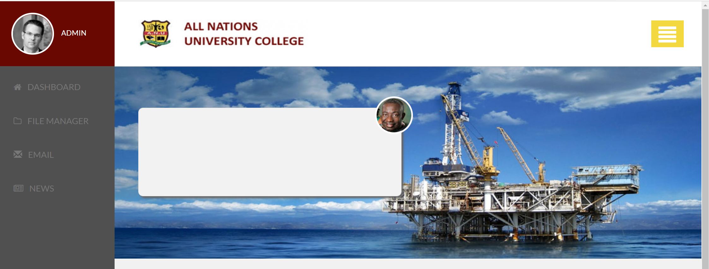

# Modular CSS

> Getting hands on SASS, types of .scss!
---
### Table of contents

- [Description](#description)
- [References](#references)
- [Author](#author)

---

## Description

first step towards learning sass program and experimenting  the code to convert into .scss, from an existing CSS code. Building different scss files(_var, _mixins, _main etc..) in sass/modules and linking all the scss files in main or master file. which then gets complilled to css. Learnt to use sass --watch command. 

### Technologies 
- Git bash
- Visual Studio Code

---

## References
- website
- youtube

---

## Author

Sarthak Shah

